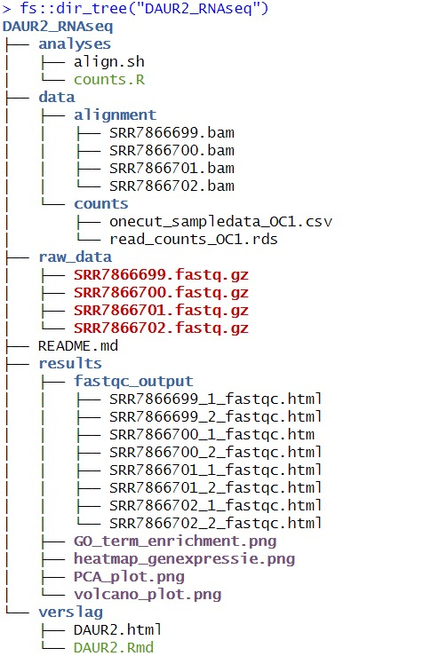
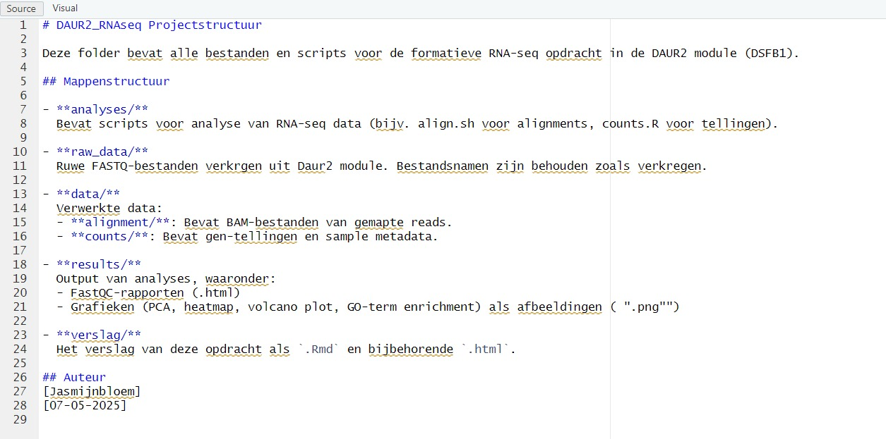

# Guerilla analytics

_Data Management volgens Guerilla Analytics_

In dit stukje werden de richtlijnen van **Guerilla Analytics** toegepast. Guerilla Analytics is een werkwijze voor datamanagement die zich richt op **praktisch, flexibel en reproduceerbaar werken met data**, vooral in snel veranderende of tijdelijke projecten.

De kernprincipes zijn:

- **Heldere mapstructuur**: Bestanden worden logisch gescheiden in mappen zoals `raw_data`, `data`, `analyses` en `results`.
- **Nooit wijzigen van ruwe data**: De originele bestanden blijven altijd intact.
- **Script-based workflows**: Analyses worden in scripts opgeslagen om reproduceerbaarheid te geven.
- **Transparante documentatie**: Er is een README-bestand dat uitlegt wat elk bestand en elke map bevat.
- **Snel overdraagbaar**: De structuur maakt het makkelijk voor anderen om het project over te nemen of na te bouwen.

Voor deze opdracht werden lege bestanden gebruikt met de juiste namen en een mappenstructuur opgezet volgens deze regels, ook al de originele data niet beschikbaar was.


## DAUR2_RNAseq

De mapstructuur van dit project heb ik opgebouwd met de volgende code: 

```{r structuur, include=TRUE, eval=FALSE}

# Laat de structuur van de DAUR2_RNAseq-map zien.

fs::dir_tree("DAUR2_RNAseq")`
``` 

De verkregen FASTQ-bestanden (de ruwe data) zijn geplaatst in de map `raw_data`. 
In de map `data` bevinden zich twee submappen:  
- `alignment`, waarin de BAM-bestanden staan met de gemapte reads  
- `counts`, waarin de gen-tellingen en de metadata van de samples zijn opgeslagen.

In de map `analyses` staan de scripts die zijn gebruikt voor de verwerking en analyse van de data. De map `results` bevat de output van deze analyses, zoals grafieken en kwaliteitsrapporten.

Tot slot is er een map `verslag` waarin het verslag van deze opdracht is opgenomen als `.Rmd`-bestand, samen met het bijbehorende `.html`-bestand (Figuur 1).





Daarnaast werd in de README-bestand uitlegt wat elk bestand en elke map bevat 
(Figuur 2).





## Portfolio van Jasmijnbloem

